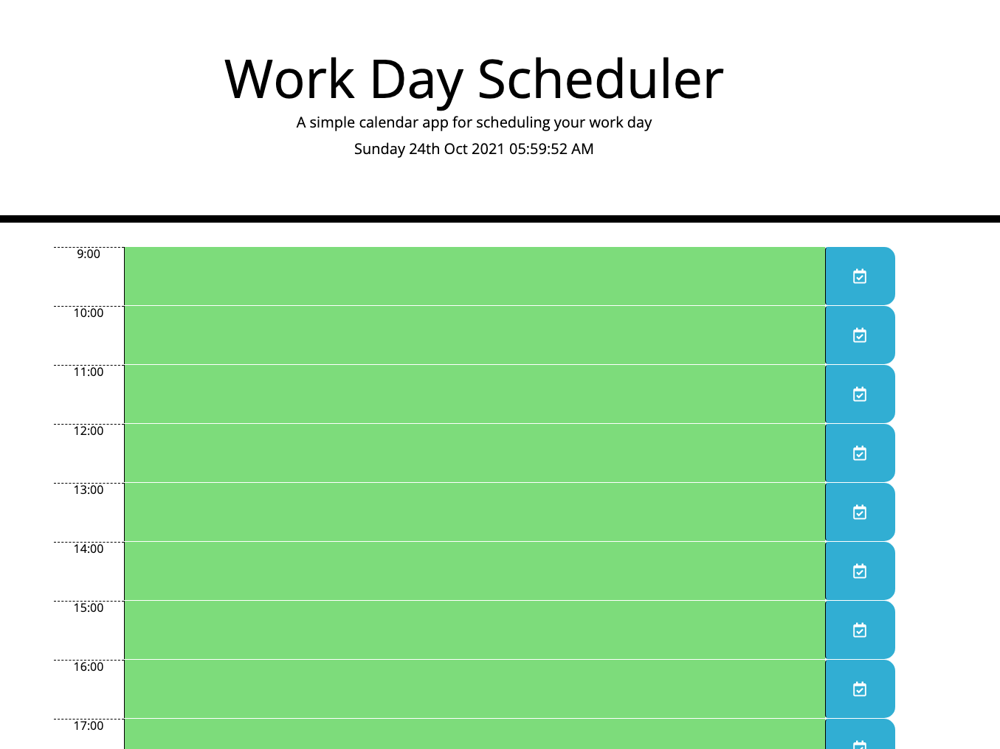

# Description

Work-Day-Scheduler is a simple calendar application that allows a user to save events for each hour of the day. It runs in the browser and feature dynamically updated HTML and CSS powered by jQuery.

This App has been deployed to GitHub pages.

The URL of the deployed application:

The URL of the GitHub repository:

# Application Screenshot

